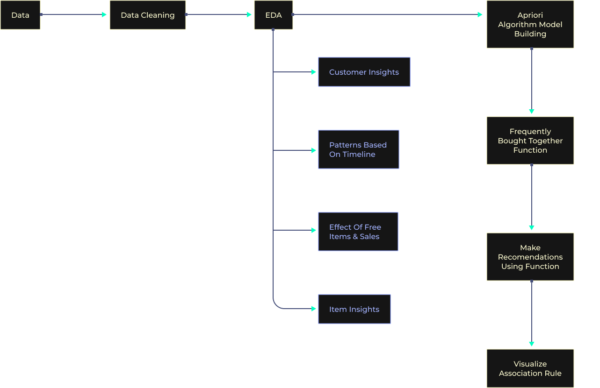

# Market Basket Analysis Recommender System

This project implements a Market Basket Analysis Recommender System using association rule mining techniques. Market Basket Analysis (MBA) is a data mining technique that identifies patterns and relationships within transactional data to understand the purchase behavior of customers. By analyzing co-occurrence patterns of items in transactions, association rule mining can uncover valuable insights into product associations and help businesses make informed decisions regarding product placement, cross-selling strategies, and personalized recommendations.

## Overview

Market Basket Analysis aims to answer questions such as "What items are frequently purchased together?" or "What are the associations between products in customer transactions?". The project employs association rule minining using Apriori algorithm to extract meaningful association rules from transactional data.

## Data Description 

The dataset is a transnational data set containing all the transactions occurring between the years 2010 to 2011 for a UK-based and registered non-store online retail. The company mainly sells unique all-occasion gifts with maximum wholesaler customers. The dataset contains information about 500K customers over eight attributes.

## How It Works

- Data Preparation: Transactional data containing records of items purchased together is collected and preprocessed.

- Association Rule Mining: The Apriori or FP-Growth algorithm is applied to the transaction data to discover frequent itemsets and association rules.

- Rule Evaluation: The generated rules are evaluated based on metrics such as support, confidence, and lift to identify meaningful and actionable associations.

- Recommendation Generation: Based on the discovered association rules, the system generates recommendations for cross-selling, product bundling, or personalized suggestions to customers.

## Advantages

- Insight Generation: Market Basket Analysis provides valuable insights into customer purchase behavior and product associations, enabling businesses to optimize marketing strategies and improve sales.

- Personalized Recommendations: By leveraging association rules, the system can offer personalized recommendations to customers based on their past purchase history or current basket contents.

- Operational Efficiency: Understanding product associations allows businesses to optimize inventory management, pricing strategies, and product placement within stores.

## Applications

- Retail Industry: Market Basket Analysis is widely used in retail for optimizing store layout, designing promotional campaigns, and improving product recommendations both online and in-store.

- E-commerce Platforms: Online retailers utilize association rule mining to enhance product recommendations, increase cross-selling opportunities, and improve the overall shopping experience for customers.

- Supply Chain Management: Market Basket Analysis helps in optimizing inventory levels, identifying complementary products, and streamlining supply chain operations.

